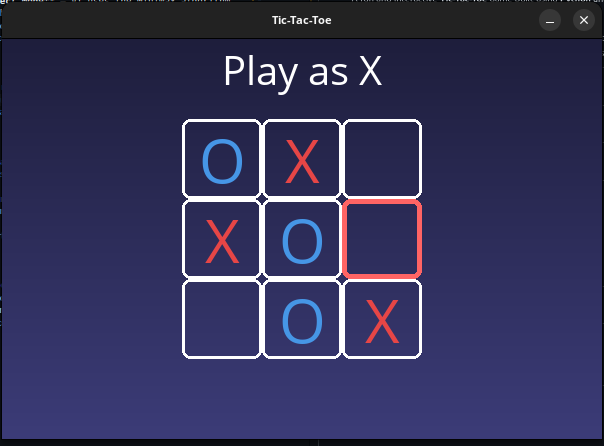

# 🎮 Tic-Tac-Toe with AI (Minimax & Random Mode)

A fun and interactive **Tic-Tac-Toe** game built using **Python** and **Pygame**, featuring:
- **Perfect Mode** – AI uses the Minimax algorithm (unbeatable 🤖)
- **Random Mode** – AI plays random moves for a more casual experience

---

## 📸 Screenshots

---

## ✨ Features
- Play as **X** or **O**
- Two AI difficulty levels:
  - **Perfect** – AI never loses
  - **Random** – AI makes random & unpredictable moves
- Clean, minimal UI with hover effects
- Restart option at the end of each game

---

## 🛠️ Tech Stack
- **Python 3.9+**
- **Pygame**
- Minimax algorithm for decision-making

---